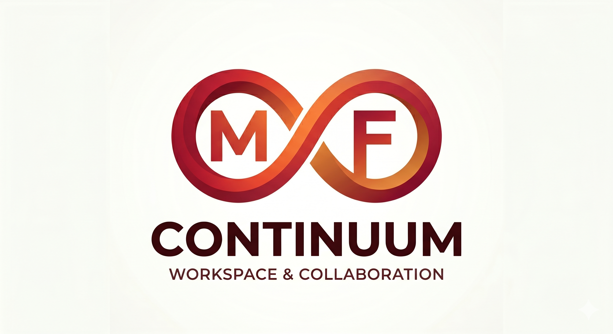

<div align="center">
  
  
  # Continuum 🚀
  **The ultimate modern workspace and Notion clone**

  <p align="center">
    <a href="#features">Features</a> •
    <a href="#tech-stack">Tech Stack</a> •
    <a href="#architecture">Architecture</a> •
    <a href="#getting-started">Getting Started</a>
  </p>
</div>

---

## 📝 Overview
Continuum is a high-performance, real-time collaborative workspace built to mirror the core functionality of Notion. Designed with offline support, AI-driven writing assistance, and multiplayer editing, Continuum allows individuals and teams to organize their thoughts, tasks, and schedules seamlessly.

---

## ✨ Features

- **⚡ Real-time Collaboration:** Type alongside your peers with live cursors and instant synchronization using Liveblocks.
- **📱 Progressive Web App (PWA):** Install the app natively on Desktop or Mobile. Full offline support allowing you to read and write notes without Wi-Fi, syncing instantly upon reconnection.
- **🤖 Magic AI Integration:** Built-in generative AI (powered by Gemini) via custom `/ai` slash commands to summarize, rewrite, or extract tasks from your text.
- **🌳 Infinite Document Nesting:** Create child documents inside parent documents infinitely to structure your knowledge base.
- **🕒 Version History:** Automatic document snapshotting every 5 minutes with a built-in time machine to preview and restore previous versions.
- **🖼️ Rich Media Uploads:** Drag and drop cover images and file attachments directly into the editor, powered by EdgeStore.
- **📊 Advanced Views:** Switch between the standard Rich Text Editor, Kanban Board, and Calendar views to visualize your data dynamically.
- **🔒 Secure Authentication:** Handled seamlessly via Clerk, supporting Email, Google, and GitHub single sign-on.
- **🌙 Dark Mode:** Beautiful, pixel-perfect light and dark themes tailored with Tailwind CSS and Shadcn UI.

---

## 🛠️ Tech Stack

- **Framework:** [Next.js 16](https://nextjs.org/) (App Router, Turbopack)
- **Language:** TypeScript
- **Database / Backend:** [Convex](https://www.convex.dev/) (Real-time reactive database)
- **Multiplayer / WebSockets:** [Liveblocks](https://liveblocks.io/)
- **Authentication:** [Clerk](https://clerk.com/)
- **Rich Text Editor:** [BlockNote](https://www.blocknotejs.org/) (ProseMirror based)
- **Object Storage:** [EdgeStore](https://edgestore.dev/)
- **Styling:** Tailwind CSS & [Shadcn UI](https://ui.shadcn.com/)
- **Offline Support:** `@ducanh2912/next-pwa`

---

## 📐 Architecture

Continuum's architecture is highly decentralized across specialized managed services, making it infinitely scalable and entirely serverless.

1. **Frontend (Vercel):** The Next.js application serves React Server Components and Client Components. The `next-pwa` plugin injects Service Workers at build time for offline caching.
2. **Data Layer (Convex):** All documents, hierarchy relationships, and version histories are stored in Convex. UI components subscribe to queries via `useQuery`, providing instant reactivity when data changes.
3. **Collaboration Layer (Liveblocks):** When the editor mounts, Liveblocks establishes a WebSocket connection. It utilizes Yjs (Conflict-free Replicated Data Types) to merge simultaneous user edits in real-time without data loss.
4. **Auth Layer (Clerk):** Middleware intercepts requests to secure private routes. Authentication tokens are passed into both Convex and Liveblocks to authorize database reads and multiplayer room access.

---

## 🚀 Getting Started

Follow these instructions to set up the project locally.

### 1. Clone the repository
```bash
git clone https://github.com/Faham-from-nowhere/Continuum.git
cd Continuum
```

### 2. Install dependencies
```bash
npm install
```

### 3. Setup Environment Variables
Create a `.env.local` file in the root directory and add the following keys. You will need to obtain these from their respective dashboards:
```env
NEXT_PUBLIC_CLERK_PUBLISHABLE_KEY=
CLERK_SECRET_KEY=
NEXT_PUBLIC_CLERK_SIGN_IN_URL=/sign-in
NEXT_PUBLIC_CLERK_SIGN_UP_URL=/sign-up
NEXT_PUBLIC_CLERK_AFTER_SIGN_IN_URL=/documents
NEXT_PUBLIC_CLERK_AFTER_SIGN_UP_URL=/documents

NEXT_PUBLIC_CONVEX_URL=

NEXT_PUBLIC_LIVEBLOCKS_PUBLIC_KEY=
LIVEBLOCKS_SECRET_KEY=

EDGE_STORE_ACCESS_KEY=
EDGE_STORE_SECRET_KEY=

GEMINI_API_KEY=
```

### 4. Initialize Convex
Push the database schema and functions to your Convex development environment:
```bash
npx convex dev
```

### 5. Run the Application
In a separate terminal, start the Next.js development server:
```bash
npm run dev
```

Your app will now be running on `http://localhost:3000`.

---
<div align="center">
  <i>Built with passion to elevate your productivity.</i>
</div>

**Note** :== This Project extends the Jotion build by CodeWithAntonio and adds AI features, real time collaboration, PWA, version History and advanced views amongst other things. Thank you [AntonioErdeljac](https://github.com/antonioerdeljac)) 
