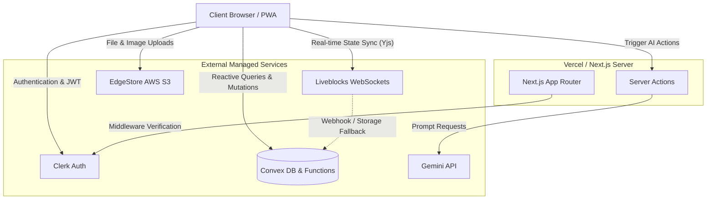

<div align="center">
  
  
  # Continuum 🚀
  **The ultimate modern workspace inspired by Notion**

  <p align="center">
    <a href="#features">Features</a> •
    <a href="#implementation-details">How It Works</a> •
    <a href="#architecture">Architecture</a> •
    <a href="#getting-started">Getting Started</a>
  </p>

  <p align="center">
    
    
    
    
    
    
  </p>
</div>

---

## 📝 Overview
Continuum is a high-performance, real-time collaborative workspace built to mirror the core functionality of Notion. Designed with offline support, AI-driven writing assistance, and multiplayer editing, Continuum allows individuals and teams to organize their thoughts, tasks, and schedules seamlessly.

---

## ✨ Features

- **⚡ Real-time Collaboration:** Type alongside your peers with live cursors and instant synchronization.
- **📱 Progressive Web App (PWA):** Install the app natively on Desktop or Mobile. Full offline support.
- **🤖 Magic AI Integration:** Built-in generative AI (powered by Gemini) via custom `/ai` slash commands.
- **🌳 Infinite Document Nesting & Sidebar:** Create child documents inside parent documents infinitely to structure your knowledge base. The sidebar dynamically expands and collapses recursively.
- **🗑️ Soft Delete & Trash:** Move documents to the trash, restore them, or permanently delete them via a dedicated Trash UI.
- **🌍 Publish to Web:** Toggle a document's visibility to "Public" and generate a read-only live URL for anyone on the internet to view.
- **🕒 Version History:** Automatic document snapshotting every 5 minutes with a built-in time machine.
- **🖼️ Rich Media Uploads:** Drag and drop cover images and file attachments directly into the editor.
- **📊 Advanced Views:** Switch between the standard Rich Text Editor, Kanban Board, and Calendar views.
- **🔒 Secure Authentication:** Handled seamlessly via Clerk, supporting Email, Google, and GitHub single sign-on.
- **🌓 Theme Toggle:** Pixel-perfect Dark and Light modes controlled by `next-themes` and styled with Tailwind CSS, seamlessly synced with your system preferences.

---

## 🧠 Implementation Details

How the magic happens under the hood:

- **Offline-First PWA:** Utilizes `@ducanh2912/next-pwa` to register Service Workers at build time. Static assets and database query responses are heavily cached, allowing users to load and read the app with zero internet connection. Edits made offline via Liveblocks are queued locally and automatically pushed to the server upon reconnection.
- **Multiplayer Editor:** Built on **BlockNote** (a block-based ProseMirror editor) and bound to a **Liveblocks Yjs** document. Yjs uses Conflict-free Replicated Data Types (CRDTs) to mathematically resolve simultaneous edits from multiple users without merge conflicts or data loss.
- **AI Slash Commands:** We extended the native BlockNote `SuggestionMenuController` to inject custom `/ai summarize` and `/ai tasks` commands. These commands trigger Next.js Server Actions which securely interface with the Gemini API to stream responses directly back into the DOM relative to the cursor position.
- **Recursive Database Architecture:** **Convex** acts as our real-time backend. Relationships between documents are structured adjacently using a `parentDocument` foreign key. The sidebar utilizes recursive React components to continuously query and render infinitely deep document trees without fetching the entire database at once. 
- **Soft Delete Mechanism:** When a document is archived, an edge-function recursively marks all of its child documents (and their children) as `isArchived: true`. The documents are then hidden from the main sidebar and routed to a specialized Trash query.
- **Time Machine (Version History):** Inside the Convex `updateDocument` mutation, we check the `versions` table. If the last saved snapshot is older than 5 minutes, we stringify the editor's JSON block state and save a new historical record, allowing 1-click reversion.

---

## 📐 Architecture



---

## 🚀 Getting Started

Follow these instructions to set up the project locally.

### 1. Clone the repository
```bash
git clone https://github.com/Faham-from-nowhere/Continuum.git
cd Continuum
```

### 2. Install dependencies
```bash
npm install
```

### 3. Setup Environment Variables
Create a `.env.local` file in the root directory and add the following keys. You will need to obtain these from their respective dashboards:
```env
NEXT_PUBLIC_CLERK_PUBLISHABLE_KEY=
CLERK_SECRET_KEY=
NEXT_PUBLIC_CLERK_SIGN_IN_URL=/sign-in
NEXT_PUBLIC_CLERK_SIGN_UP_URL=/sign-up
NEXT_PUBLIC_CLERK_AFTER_SIGN_IN_URL=/documents
NEXT_PUBLIC_CLERK_AFTER_SIGN_UP_URL=/documents

NEXT_PUBLIC_CONVEX_URL=

NEXT_PUBLIC_LIVEBLOCKS_PUBLIC_KEY=
LIVEBLOCKS_SECRET_KEY=

EDGE_STORE_ACCESS_KEY=
EDGE_STORE_SECRET_KEY=

GEMINI_API_KEY=
```

### 4. Initialize Convex
Push the database schema and functions to your Convex development environment:
```bash
npx convex dev
```

### 5. Run the Application
In a separate terminal, start the Next.js development server:
```bash
npm run dev
```

Your app will now be running on `http://localhost:3000`.

---
<div align="center">
  <i>Built with passion to elevate your productivity.</i>
</div>


**Note** :== This Project extends the Jotion build by CodeWithAntonio and adds AI features, real time collaboration, PWA, version History and advanced views amongst other things. Thank you [AntonioErdeljac](https://github.com/antonioerdeljac) :) 
